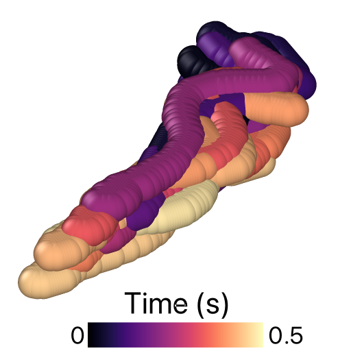

# pyMicroswim



A Python based repository to track and segment sperm cells. It allows the identification of individual cells imaged using 3D fast microscopy.

**Note**: The 3D microscopy system employed here consist of a piezo actuator that displaces the sample vertically. Therefore, z positions are extraced independently from the tracking code.

Current segmentation methods are based on DBSCAN ML algorithms, but this can be improved by implementing U-net convolutional NNs trained from experimental and simulated samples.

## Usage: Quick Start

A notebook for flagellum tracking is provided inside the ```example``` folder.

Briefly, use the following code to read image stacks. 

```Python
from src.utils import load_images

directory = "..."
filename  = "flagellum"
fmt       = ".tif"  #image stack format

nframes   = 500

img_stack = load_images(f"{directory}{filename}{fmt}",crop=True,cut_npx=2)

```

```utils``` also includes ```load_movie_frames``` which allows to read ```.avi``` formats directly.

Prior to segementation, images have to be pre-processed for a better identification of the cell individual sections, i.e. head and flagellum. Use

```Python
from src.segment     import Segment

kwargs = {
    "min_bright"     : 0.45, #Brightness threshold used for img processing and segment location
    "rot_ang"        : 30,    # Angle to rotate imgs if needed
    "neigh_distance" : 2,    # Max distance to find neighbour points during segmentation
    "min_neighs"     : 1,    # Minimum number of neighbours 
}

pp = Preprocess(imgs=img_stack,**kwargs)
pimgs = pp.process_img_stack()
```

If know load the z positions from the external piezo device

```Python
from src.utils import *

#Z-positions are recovered from external piezo device
zfile = f"{directory}piezo_sequence.txt"

time,positions = load_piezo_actuation(zfile)
zpositions, timesteps = complete_z_positions(duration=time,positions=positions,nimgs=nframes)
```

Then the images can be analysed to find the positions of the different segments using

```Python
from src.segment import Segment 

s = Segment(imgs=pimgs,zpositions=zpositions,timesteps=timesteps,**kwargs)
time_segments = s.run_segmentation_all()
```

Thhis will return a dictionary containing positions for both the head and flagellum. We can select one of the two by means of the ```segment_size```, which tends to be larger for the flagellum

```Python
flagellum = s.find_all_segments_time(time_segments,segment_size=150)
```

Finally, the shape of the flagellum can be reconstructed using. **Note**: current reconstruction implements polynomial using ```polynomial_degree```. Other fitting alternatives will be tested and implemented in future. 

```Python
from src.reconstruct import Reconstruct

r = Reconstruct(segment_data=time_segments,labelled_segments=flagellum,polynomial_degree=5)
reconst = r.process_all_segments()
```